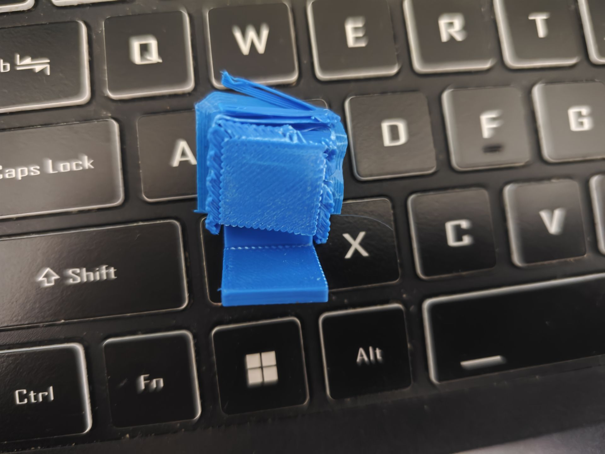

<!-- PROJECT SHIELDS -->

<!-- PROJECT LOGO -->
 

  

  <h3 align="center">MKP Support</h3>

  

    Better supports for FDM prints
     
    <a href="https://github.com/YZcat2023/MKPSupport/blob/main/MKP%20Manual.pdf"><strong>Download MKP Manual »</strong></a>
     
     
  

<!-- TABLE OF CONTENTS -->

  
Table of Contents

  <ol>
    <li>
      <a href="#about-the-project">About The Project</a>
      <ul>
        <li><a href="#built-with">Built With</a></li>
      </ul>
    </li>
    <li><a href="#illustration">Illustration</a></li>
    <li>
      <a href="#getting-started">Getting Started</a>
      </ul>
    </li>
    <li><a href="#roadmap">Roadmap</a></li>
    <li><a href="#contributing">Contributing</a></li>
    <li><a href="#license">License</a></li>
    <li><a href="#contact">Contact</a></li>
    <li><a href="#acknowledgments">Acknowledgments</a></li>
  </ol>

<!-- ABOUT THE PROJECT -->
## About The Project
When printing parts using FDM 3D printers, supports often pose a significant challenge. They can be difficult to remove, leaving the surface of the part uneven. Therefore, reducing the layer adhesion between the support layers and the part could be a viable solution. That's why we're here—to introduce MKP Support, which delivers better results: the support surface is smooth, flat, and non-sticky, with no color difference from the main body of the part. Thanks to the incorporated function of ironing the support surface, the results may even surpass those achieved with water-soluble supports. With just four magnets, two screws, a bottle of liquid glue, and other necessary items, you can upgrade your printer. It can be run as a post-processing program in OrcaSlicer. Simply press the button, just like in the previous workflow!
<!-- FDM3D打印零件时，支撑总是一个让人头疼的问题。它们有时很难移除，移除后的零件表面也不太平整。那么，降低支撑层与零件间的层粘也许是一个好主意？试试看MKP Support吧，它能实现相当好的效果：
支撑面光滑平整不粘手，且颜色与零件主体没有区别。由于加入了熨烫支撑面的功能，也许效果比使用水溶支撑还要好。只需要四块磁铁，两个螺丝，一瓶液体胶等等，您就可以升级您的打印机。
我找来了一只马克笔涂抹支撑面，结果相当成功。接触面看上去很平滑。不过，马克笔的方案并不十分令人满意：它似乎不能在CoreXY机器上工作。于是我找来了一些 gluepen refills("点点胶替芯" in Chinese）。胶水是透明的，因此接触面效果更加好了。不过，它似乎很容易就用完了。所以我设计了一个零件用来储存胶水，并且重新编写了程序。 -->

<!-- 使用MKP Support,可以减少时间与材料的浪费
使用MKP Support,可以提高接触面的表面效果
使用MKP Support,可以提高打印的成功率 -->
Here's why:
* Using MKP Support can reduce waste of time and materials.
* Using MKP Support can enhance the surface finish of the contact area.
* Using MKP Support can increase the success rate of printing.

### Built With

  

## Illustration
Here are some printed samples. More photos may come, stay tuned!

(<a href="#readme-top">back to top</a>)

<!-- GETTING STARTED -->
## Getting Started
For more details, please refer to MKP Manual.pdf.
1.	Have some gluepen refills("点点胶替芯" in Chinese）and one bottle of liquid glue.
Get two M2.5*5 screws and four magnets with a diameter of 4mm and a thickness of 1.5mm.
2.	Download the 3D printing models provided in the folder and print them. Assemble the printed parts and install them in a proper location on your 3D printer. You may need some modification in order to suit your own printer. 
3.	Configure Settings: Run the software and fill in the required information in the dialog box. It will generate a config file. Then copy the path of MKP3.0.exe and go to your Orca Slicer settings, paste it and change several settings. If you’re using printers shipped with klipper firmware, then creating several macro is prefered.
4.	Click Slicing button and enjoy. You can also place your Gcode file in the same folder as this software and start the software. 

<!-- ROADMAP -->
## Roadmap

- [x] Ironing support interfaces option
- [x] Add MKP Manual.pdf
- [ ] Multi-language Support
    - [ ] English
- [ ] Add multi-color support

See the [open issues](https://github.com/YZcat2023/MKPSupport/issues) for a full list of proposed features (and known issues).

(<a href="#readme-top">back to top</a>)

<!-- CONTRIBUTING -->
## Contributing
Thanks to thkfy for programming supports and okookey for translating the English instructions

<!-- LICENSE -->
## License

Distributed under the Unlicense License. See `LICENSE.txt` for more information.

(<a href="#readme-top">back to top</a>)

<!-- CONTACT -->
## Contact
Jhmodel01@outlook.com
Project Link: [https://github.com/YZcat2023/MKPSupport](https://github.com/YZcat2023/MKPSupport)

(<a href="#readme-top">back to top</a>)

