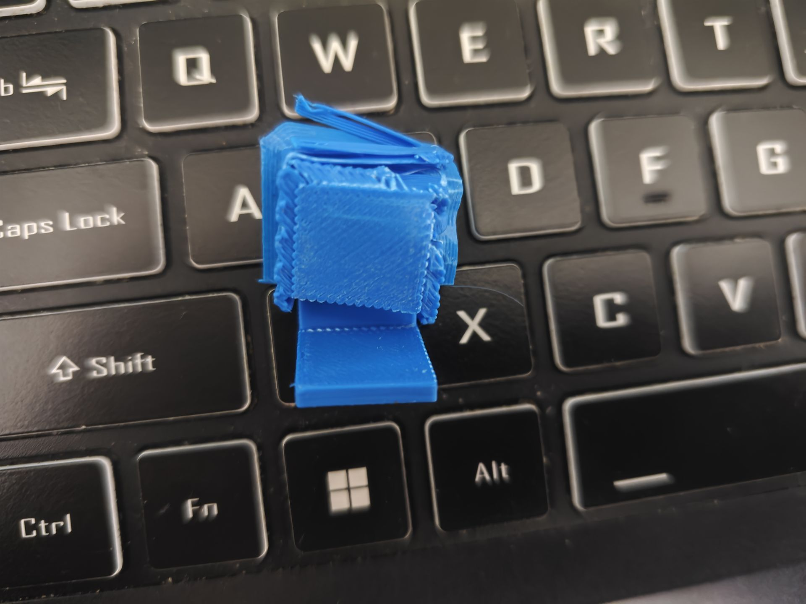
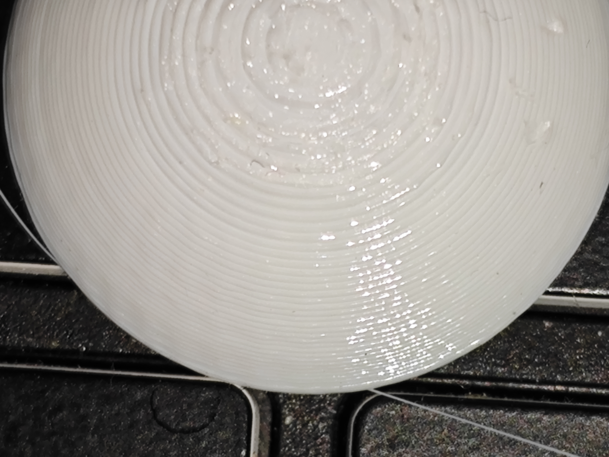

   
   <h3>MKP Support</h3>
   
Better supports for FDM prints

   <a href="#"><b>English</b></a> |
   <a href="README_zh_CN.md">中文(简体)</a>
   

      
      
      
      
   

   

      <a href="MKP%20Manual.pdf">
         <strong>Download MKP Manual »</strong>
      </a>
   

## About The Project

When printing parts using FDM 3D printers, supports often pose a significant challenge. They can be difficult to remove,
leaving the surface of the part uneven. Therefore, reducing the layer adhesion between the support layers and the part
could be a viable solution. That's why we're here—to introduce MKP Support, which delivers better results: the support
surface is smooth, flat, and non-sticky, with no color difference from the main body of the part. Thanks to the
incorporated function of ironing the support surface, the results may even surpass those achieved with water-soluble
supports. With just four magnets, two screws, a bottle of liquid glue, and other necessary items, you can upgrade your
printer. It can be run as a post-processing program in OrcaSlicer. Simply press the button, just like in the previous
workflow!

Here's why:

* Using MKP Support can reduce waste of time and materials.
* Using MKP Support can enhance the surface finish of the contact area.
* Using MKP Support can increase the success rate of printing.

## Samples

Here are some printed samples. More photos may come, stay tuned!

## Getting Started
Before starting, we suggest joining our group: QQ，668350689.

For more details, please refer to [MKP Manual.pdf](MKP-English.pdf).

1. Have some gluepen refills("点点胶替芯" in Chinese）and one bottle of liquid glue.
   Get two M2.5*5 screws and four magnets with a diameter of 4mm and a thickness of 1.5mm.
2. Download the 3D printing models provided in the folder and print them. Assemble the printed parts and install them in
   a proper location on your 3D printer. You may need some modification in order to suit your own printer.
3. Configure Settings: Run the software and fill in the required information in the dialog box. It will generate a
   config file. Then copy the path of MKP3.0.exe and go to your Orca Slicer settings, paste it and change several
   settings. If you’re using printers shipped with klipper firmware, then creating several macro is prefered.
4. Click Slicing button and enjoy. You can also place your Gcode file in the same folder as this software and start the
   software.

## Roadmap

- [ ] Add multi-color support
- [x] Ironing support interfaces option

## Contributing

Thanks to thyfk for programming supports and okookey for translating the English instructions
<!-- TODO: 贡献者成员名单 -->

## License

This project is licensed under **The Unlicense**. You are free to use, modify, and distribute the code for any purpose.
For details, see the [`LICENSE`](../LICENSE) file.

## Contact

Send an email to `Jhmodel01@outlook.com`
