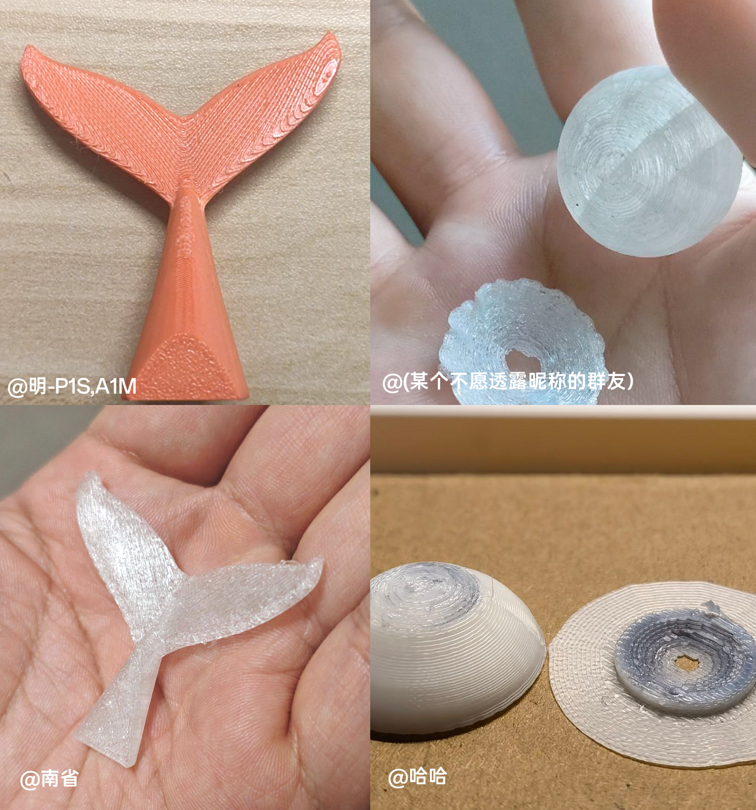

   
   <h3>MKP Support</h3>
   

   

      
      
      
      
      
   

   <a href="README.md">English</a> |
   <a href="#"><b>中文(简体)</b></a>
   

      </a>
   

## ✨ What is MKP Support?

Still troubled by hard-to-remove 3D printing supports and the marks they leave behind? MKP Support makes removing supports as easy as peeling off a sticky note!

**In simple terms**: We've invented a method of applying an adhesive layer on the support interface, which leaves the contact surface smooth and flat, almost invisible, and incredibly easy to remove.

## 🖊️ Why is it better than traditional methods?

**Compared to standard supports**: No more prying with knives or pulling with pliers. Say goodbye to scratched fingers, while achieving an exceptionally smooth finish.

**Compared to water-soluble supports**: No need to buy specialized water-soluble filaments, no worries about moisture absorption. The results are nearly identical, but the cost is completely different.

**Extremely simple assembly**: The parts only require magnets, screws, springs (for P1/X1), pen refills, etc.

## 🎯 Expected Results

✅ **Saves Time**: Support removal goes from minutes to seconds.

✅ **Saves Material**: MKP doesn't require material changes or flushing.

✅ **Perfect Surface**: The support contact surface is flat and smooth.

✅ **Increases Success Rate**: Reduces the risk of damage during support removal.

## 📸 Demo

Showcase of actual printed test pieces. Note the extremely smooth support surface:

## 📦 Quick Start

### 1. Prepare Materials

🛒 You need to purchase the components indicated in the BOM list for your specific printer model.

  <a href="Printers/P1/"><strong>P1</strong></a> 
  <a href="Printers/A1/"><strong>A1</strong></a> 
  <a href="Printers/A1M/"><strong>A1M</strong></a>
### 2. Install Hardware

- **Download and Print** the parts for your printer model.
- **Assemble the parts**: Follow the instructional video to assemble the device.

### 3. Configure Software

**Download the program**: [Go to the Releases page](https://github.com/YZcat2023/MKPSupport/releases)

## 🛠️ In Development

🔧 **Planned for the near future**:

- [x] Multi-color printing support
- [x] More fine-tuning options
- [ ] Support for more printer models

📋 **See the full list**: [Issues page](https://github.com/YZcat2023/MKPSupport/issues)

For a complete list of proposed features (and known issues), please refer to the [issues](https://github.com/YZcat2023/MKPSupport/issues).

## 🤝 Contributing to This Project

- We are looking for capable developers to join us and make this project better. If you are willing to join, please feel free to contact us. We welcome you warmly.
- You can also help the developers by submitting [Pull Requests](https://github.com/YZcat2023/MKPSupport/pulls)! Submitting a pull request is also a way to contribute to this project. We will review your submission and then take over maintenance.
- Also, please see the [issues](https://github.com/YZcat2023/MKPSupport/issues).

### 🙏 Contributors

- Thanks to thyfk for programming supports and okookey for translating the English instructions

<!-- TODO: Contributor List -->

## 📄 License

This project is licensed under **The Unlicense**. This means you are free to use, modify, and distribute the code in this project. For more information, please refer to [`LICENSE`](../LICENSE).

## 📞 Contact Us

Please send an email to `Jhmodel01@outlook.com` or join the QQ group: 668350689.
